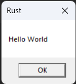
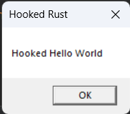

# winhook-rs

[](https://github.com/SubconsciousCompute/winhook-rs/actions/workflows/main.yml)

> Windows API hooking is one of the techniques used by AV/EDR solutions to determine if code is malicious.
> A `MessageBoxA` function will be hooked in this instance, but it could be any.
>
> A simple program that will work follows:
>
> 1. Get memory address of the `MessageBoxA` function
> 2. Read the first 6 bytes of the `MessageBoxA` - will need these bytes for unhooking the function
> 3. Create a `HookedMessageBox` function that will be executed when the original `MessageBoxA` is called
> 4. Get memory address of the `HookedMessageBox`
> 5. Patch/redirect `MessageBoxA` to `HookedMessageBox`
> 6. Call `MessageBoxA`. Code gets redirected to `HookedMessageBox`
> 7. `HookedMessageBox` executes its code, prints the supplied arguments, unhooks the `MessageBoxA` and transfers the
     code control to the actual `MessageBoxA`

[Read code for more details in comments](src/main.rs) or [jump to bottom](#code).

## Running

We need to build for `32bit` systems:

1. `rustup default stable-i686-pc-windows-msvc` or `cargo +stable-i686-pc-windows-msvc run`
2. `cargo run --release`

## Output



```
================
Hooked!!!
original-lptext: Hello World
original-lpcation: Rust
================

================
Hooked!!!
hooked-lptext: Hooked Hello World
hooked-lpcation: Hooked Rust
================
```



## LICENSE

This project is licensed under the MIT License - see the [LICENSE](LICENSE.md) file for details

## Acknowledgments

* [ired.team notes](https://www.ired.team/)

## Code

```rust
// cargo +stable-i686-pc-windows-msvc run

use std::ffi::c_void;

use windows::{
    core::PCSTR,
    s,
    Win32::{
        Foundation::HWND,
        System::{
            Diagnostics::Debug::{ReadProcessMemory, WriteProcessMemory},
            LibraryLoader::{GetProcAddress, LoadLibraryA},
            Threading::GetCurrentProcess,
        },
        UI::WindowsAndMessaging::{MessageBoxA, MESSAGEBOX_RESULT, MESSAGEBOX_STYLE},
    },
};

static mut MESSAGE_BOX_ORIGINAL_BYTES: [u8; 6] = [0; 6];
static mut BYTES_WRITTEN: usize = 0;
static mut MESSAGE_BOX_ADDRESS: Option<unsafe extern "system" fn() -> isize> = None;

fn main() {
    unsafe {
        // Show messagebox before hooking
        //
        // Pop the message box before the function is hooked - just to make sure it works and to
        // prove that no functions are hooked so far -  it's the first instruction of the program
        MessageBoxA(HWND(0), s!("Hello World"), s!("Rust"), Default::default());

        let dll_handle = LoadLibraryA(s!("user32.dll")).unwrap();
        let bytes_read: usize = 0;

        // Get address of the `MessageBox` function in memory
        //
        // If we disassemble the bytes at that address, we will definitely see that there is code for
        // `MessageBoxA`
        MESSAGE_BOX_ADDRESS = GetProcAddress(dll_handle, s!("MessageBoxA"));

        // save the first 6 bytes of the original MessageBoxA function - will need for unhooking
        //
        // Note the first 6 bytes <xx xx xx xx xx xx>(mind the endian-ness, where `xx` is some hex address).
        // We need to save these bytes for future when we want to unhook MessageBoxA
        ReadProcessMemory(
            GetCurrentProcess(),
            MESSAGE_BOX_ADDRESS.unwrap() as *const c_void,
            MESSAGE_BOX_ORIGINAL_BYTES.as_ptr() as *mut c_void,
            6,
            Some(bytes_read as *mut usize),
        );

        // Create a patch `push <address of new MessageBoxA); ret`
        //
        // Let's now build the patch (hook) bytes:
        let hooked_message_box_address = (HookedMessageBox as *mut ()).cast::<c_void>();
        let offset = hooked_message_box_address as isize;
        let mut patch = [0; 6];
        patch[0] = 0x68;
        let temp = offset.to_ne_bytes();
        patch[1..5].copy_from_slice(&temp[..4]);
        patch[5] = 0xC3;
        // ...that will translate into the following assembly instructions:
        //
        // ```asm
        // // push HookedMessageBox memory address onto the stack
        // push HookedMessageBox
        // // jump to HookedMessageBox
        // ret
        // ```

        // Patch the `MessageBoxA`
        //
        // We can now patch the `MessageBoxA` - memory pane in the bottom right shows the patch being
        // written to the beginning of `MessageBoxA` function and the top right shows the beginning of
        // the same function is re-written with a `push <address that jumps to our hooked function>;
        // ret` instructions
        WriteProcessMemory(
            GetCurrentProcess(),
            MESSAGE_BOX_ADDRESS.unwrap() as *const c_void,
            patch.as_ptr().cast::<c_void>(),
            6,
            Some(BYTES_WRITTEN as *mut usize),
        );

        // show messagebox after hooking
        MessageBoxA(HWND(0), s!("Hello World"), s!("Rust"), Default::default());
    }
}

// The `HookedMessageBox` intercepts and prints out the arguments supplied to `MessageBoxA`, then
// unhooks `MessageBoxA` by swapping back the first 6 bytes to the original bytes of the `MessageBoxA`
// function and then calls the `MessageBoxA` with the supplied arguments:
#[no_mangle]
pub extern "stdcall" fn HookedMessageBox(
    hwnd: HWND,
    mut lptext: PCSTR,
    mut lpcaption: PCSTR,
    utype: MESSAGEBOX_STYLE,
) -> MESSAGEBOX_RESULT {
    unsafe {
        // Print intercepted values from the MessageBoxA function
        println!(
            "================\nHooked!!!\noriginal-lptext: {}\noriginal-lpcation: {}\n================",
            lptext.to_string().unwrap(),
            lpcaption.to_string().unwrap(),
        );

        // Change intercepted values from the MessageBoxA function
        lptext = s!("Hooked Hello World");
        lpcaption = s!("Hooked Rust");

        // Print new values from the MessageBoxA function
        println!(
            "\n================\nHooked!!!\nhooked-lptext: {}\nhooked-lpcation: {}\n================",
            lptext.to_string().unwrap(),
            lpcaption.to_string().unwrap(),
        );

        // Unpatch MessageBoxA
        WriteProcessMemory(
            GetCurrentProcess(),
            MESSAGE_BOX_ADDRESS.unwrap() as *const c_void,
            MESSAGE_BOX_ORIGINAL_BYTES.as_ptr().cast::<c_void>(),
            6,
            Some(BYTES_WRITTEN as *mut usize),
        );

        // call the original MessageBoxA
        MessageBoxA(hwnd, lptext, lpcaption, utype)
    }
}
```
